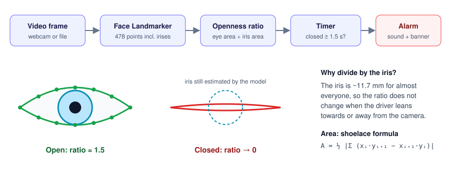

# Driver Drowsiness Detection

[](https://github.com/koushikroy/drivers_attention/actions/workflows/ci.yml)

[](LICENSE)

Real-time drowsiness detection from an ordinary webcam. The app tracks the driver's eyes with
[MediaPipe Face Landmarker](https://ai.google.dev/edge/mediapipe/solutions/vision/face_landmarker),
measures how open they are, and sounds an alarm when they stay closed for too long. Normal
blinks are counted but do not trigger the alarm.

<!-- To add a demo: record one with `drowsiness-detector --output demo.mp4`, convert it to
     docs/demo.gif (see "Recording a demo" below), then uncomment the next line.

-->



## Features

- **Distance-independent eye measurement.** Eye area is divided by iris area, so the ratio
  stays the same whether the driver leans in or sits back.
- **Time-based alerting.** The alarm fires only after the eyes stay closed for a set time
  (1.5 s by default). Shorter closures are counted as blinks.
- **Stable state changes.** A hysteresis band stops the status flickering when the ratio hovers
  near the threshold.
- **Per-user calibration.** `--calibrate` measures your open-eye ratio for a few seconds and
  sets the threshold from it, because eye shape varies between people.
- **Works on recordings too.** Process a video file, save the annotated output, and log
  per-frame measurements to CSV for analysis.
- **Handles real-world gaps.** Frames without a face are reported as "No face detected"
  instead of crashing or reusing stale measurements.

## How it works

1. **Landmarks.** Each frame goes through MediaPipe Face Landmarker, which returns 478 facial
   landmarks, including 16 points around each eye and 4 around each iris.
2. **Openness ratio.** For each eye the app computes

   ```
   ratio = area(eye outline) / area(iris outline)
   ```

   using the [shoelace formula](https://en.wikipedia.org/wiki/Shoelace_formula). The human iris
   is about 11.7 mm across for nearly everyone, and the model keeps estimating it while the lid
   closes. So the iris works as a built-in ruler: an open eye scores well above 1 and a closed
   eye collapses towards 0, regardless of distance from the camera. The two eyes are averaged so
   one partly hidden eye does not trigger an alert alone.
3. **State over time.** [`DrowsinessMonitor`](src/drowsiness_detector/monitor.py) turns the
   per-frame ratio into a state:

   | State | Meaning |
   |---|---|
   | `AWAKE` | Eyes open |
   | `EYES_CLOSED` | Below the threshold, but not for long enough to alert yet |
   | `DROWSY` | Closed for at least `--closed-seconds`; the alarm sounds |
   | `NO_FACE` | No face in the frame; the closed-eye timer resets |

   Eyes count as closed below `threshold` and as open again only above
   `threshold × 1.1`. Closures shorter than the alert window are counted as blinks.

## Installation

Requires Python 3.10 or newer and a webcam.

```bash
git clone https://github.com/koushikroy/drivers_attention.git
cd drivers_attention
python -m venv .venv
source .venv/bin/activate        # Windows: .venv\Scripts\activate
pip install -e .
```

On first run the app downloads the Face Landmarker model (about 4 MB) to
`~/.cache/drowsiness_detector/` and verifies its checksum.

## Usage

```bash
# Webcam, with calibration (recommended)
drowsiness-detector --calibrate

# A different camera, a stricter alert window, and the full face mesh drawn
drowsiness-detector --source 1 --closed-seconds 1.0 --show-mesh

# Process a recording without a window, saving annotated video and per-frame data
drowsiness-detector --source drive.mp4 --no-display --output annotated.mp4 --log-csv frames.csv
```

`python -m drowsiness_detector` works the same way. Press **q** or **Esc** to quit.

| Option | Default | Description |
|---|---|---|
| `--source` | `0` | Webcam index, or path to a video file |
| `--threshold` | `0.9` | Eye/iris ratio below which eyes count as closed |
| `--closed-seconds` | `1.5` | How long eyes must stay closed before the alarm |
| `--calibrate` | off | Measure your open-eye ratio first and set the threshold from it |
| `--calibration-seconds` | `3.0` | Length of the calibration phase |
| `--calibration-factor` | `0.6` | Threshold = factor × median open-eye ratio |
| `--mirror` / `--no-mirror` | mirror webcams only | Flip frames horizontally (selfie view) |
| `--show-mesh` | off | Draw all 478 landmarks |
| `--no-display` | off | Run without a window (for video files or servers); also mutes the alarm |
| `--no-sound` | off | Disable the audible alarm |
| `--output PATH` | none | Save the annotated video |
| `--log-csv PATH` | none | Save per-frame state and ratios |
| `--model PATH` | auto | Use a local `face_landmarker.task` instead of downloading |

> **Choosing a threshold.** The default of 0.9 is a starting point. Open-eye ratios measured
> during development were around 1.3–1.5, but they vary with the person and camera angle.
> Use `--calibrate`, or run with `--log-csv` and look at your own open and closed values.

## Project structure

```
drivers_attention/
├── src/drowsiness_detector/
│   ├── cli.py          # Command-line options
│   ├── app.py          # Capture → detect → monitor → display loop
│   ├── detector.py     # MediaPipe Face Landmarker wrapper
│   ├── geometry.py     # Shoelace area and openness ratio (pure functions)
│   ├── monitor.py      # Time-based drowsiness state machine
│   ├── calibration.py  # Per-user threshold calibration
│   ├── landmarks.py    # Eye and iris landmark indices
│   ├── overlay.py      # On-screen drawing
│   ├── alert.py        # Non-blocking audible alarm
│   ├── model.py        # Model download and caching
│   └── config.py       # Default settings
├── tests/              # Unit tests, plus an integration test with the real model
├── docs/               # Diagram (and demo GIF)
└── pyproject.toml      # Packaging, dependencies, ruff and pytest settings
```

The decision logic (`geometry.py`, `monitor.py`, `calibration.py`) has no OpenCV or MediaPipe
dependency and takes timestamps as input, so it is fully unit-tested without a camera.

## Development

```bash
pip install -e ".[dev]"
pre-commit install          # run ruff on every commit

pytest                      # all tests (downloads the model once)
pytest -m "not integration" # skip the test that loads the real model
ruff check . && ruff format --check .
```

GitHub Actions runs lint and tests on Python 3.10, 3.11 and 3.12 for every push and pull
request.

### Recording a demo

```bash
drowsiness-detector --calibrate --output demo.mp4
ffmpeg -i demo.mp4 -vf "fps=12,scale=640:-1:flags=lanczos" -loop 0 docs/demo.gif
```

## Limitations

- **Not a safety device.** This is a portfolio and research project. It is not certified for
  use in real vehicles.
- **Glasses and lighting.** Strong reflections on glasses, very low light, or infrared-only
  cameras can make the eye landmarks unreliable.
- **Head pose.** Large head turns or a head dropping out of view show as "No face detected"
  rather than as drowsiness.
- **Eye closure only.** Other signs of fatigue, such as yawning, nodding or slow blinks, are
  not yet used.

## Roadmap

- Yawn detection from mouth landmarks, and head-pose estimation for nodding
- PERCLOS (percentage of eye closure over a time window), a standard fatigue metric
- Evaluation on a public drowsiness dataset, with precision and recall figures
- Running on edge hardware such as a Raspberry Pi or Jetson Nano

## Background

This started in 2021 as a set of experimental scripts. In 2026 it was restructured into an
installable package with tests and CI, migrated from MediaPipe's retired `solutions` API to
the Tasks API, and gained time-based alerting, calibration and video-file support. The original
scripts remain in the git history.

## License

[MIT](LICENSE) © Koushik Roy

## Author

**Koushik Roy**: [GitHub](https://github.com/koushikroy) · [LinkedIn](https://www.linkedin.com/in/k-roy/)
